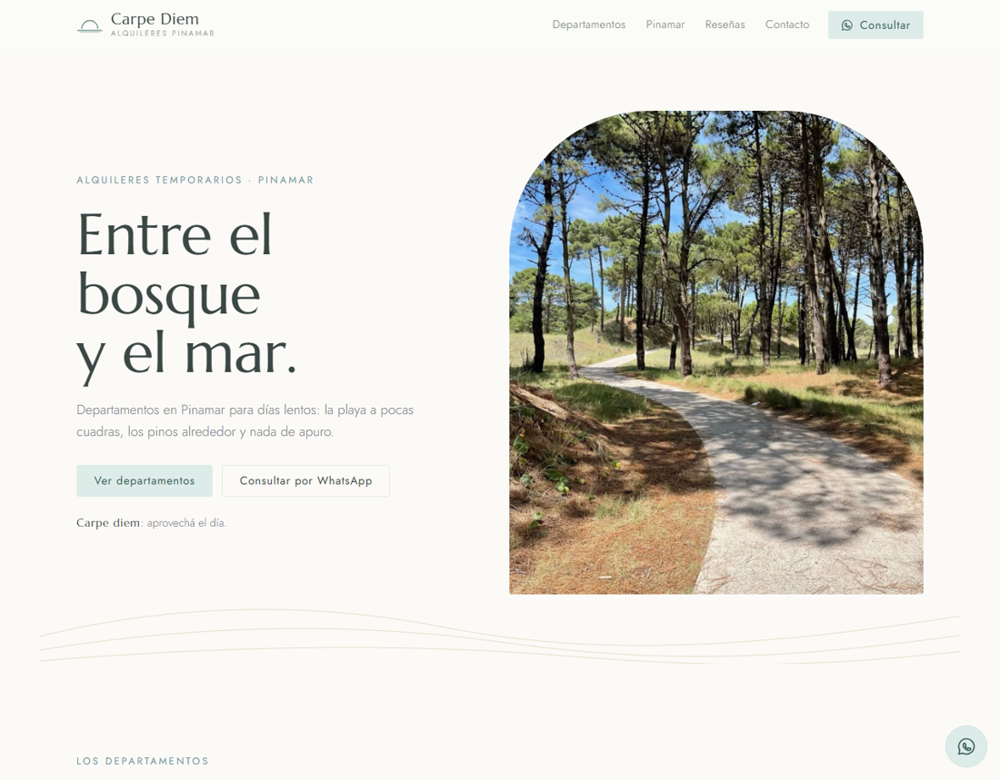
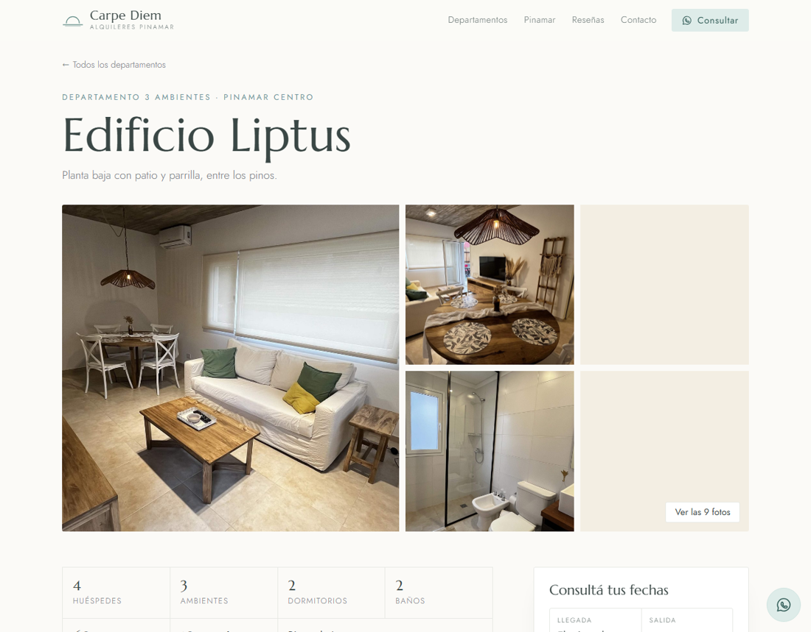

# Carpe Diem · Alquileres Pinamar

Sitio promocional de alquileres temporarios en Pinamar: cuatro departamentos con ficha
propia, galería, calendario de disponibilidad sincronizado con Google Calendar, Airbnb
y Booking, y consulta por WhatsApp con las fechas elegidas ya escritas en el mensaje.

Hecho sin frameworks ni compilación: HTML, CSS y JavaScript, más una función serverless
para el calendario. Todo el contenido se edita en un único archivo de datos, pensado
para que lo mantenga alguien que no programa.



---

## Qué resuelve

Quien alquila por temporada suele repetir siempre las mismas tres cosas por WhatsApp:
qué tiene el departamento, si está libre en tales fechas y cuánto sale. Este sitio se
ocupa de las dos primeras y deja la tercera para la conversación, que es donde se cierra
la reserva.

- **Ficha detallada por departamento:** capacidad, distribución ambiente por ambiente,
  comodidades agrupadas, normas de la casa y qué hay cerca. Cada una tiene su link
  propio (`#/liptus-merluza`) para compartir en redes.
- **Calendario de disponibilidad real:** las fechas ocupadas salen de los calendarios
  iCal de Google, Airbnb o Booking. El visitante elige llegada y salida sobre el
  calendario y no puede armar un rango que pise noches ocupadas.
- **Reglas de estadía por temporada:** de diciembre a marzo solo se alquila por semanas
  completas, de sábado a sábado, encadenando las que haga falta; el resto del año, sin
  restricción. El calendario apaga los días que no se pueden elegir y explica por qué.
  Las reglas son configuración, no código.
- **WhatsApp con contexto:** el botón abre el chat con el mensaje ya escrito, con el
  edificio, las fechas y la cantidad de noches.
- **Ubicación aproximada:** mapa centrado en la zona, con un círculo de 300 metros, como
  hacen Airbnb y Booking. La dirección exacta se envía al confirmar la reserva.
- **Datos para un bot:** un script exporta toda la información a JSON para un asistente
  de WhatsApp montado en n8n.



## Stack

| Capa | Herramienta | Por qué |
|---|---|---|
| Front-end | HTML, CSS y JavaScript sin framework | El sitio tiene que durar años y poder mantenerlo una persona no técnica. Sin build ni dependencias que actualizar |
| Estilos | CSS moderno: variables, grid, `clamp()`, `color-mix()` | Paleta y escala tipográfica en un solo lugar; responsive sin media queries de más |
| Mapas | [Leaflet](https://leafletjs.com/) + teselas de OpenStreetMap | Gratis y sin clave de API. Filtro CSS para que el mapa acompañe la paleta |
| Calendario | Formato iCal (`.ics`) de Google Calendar, Airbnb y Booking | Es el estándar que ya exportan todas las plataformas de reservas |
| Back-end | PHP 7+ **o** función serverless de Netlify (Node 18+) | La misma respuesta desde dos tecnologías, según dónde se publique |
| Tipografías | Marcellus y Jost, de Google Fonts | Una romana serena para los títulos y una geométrica liviana para el texto |
| Herramientas | Node y Python para los scripts de generación | Logo, exportación para el bot y copias del calendario |

## Cómo funciona el calendario

Un navegador no puede descargar los archivos `.ics` de Google, Airbnb o Booking:
esos servidores no habilitan pedidos desde otro dominio. Siempre hace falta algo en el
medio. El sitio prueba tres fuentes, en orden:

```
1. /ical/calendario.php?id=<departamento>   → en vivo (PHP o función de Netlify)
2. /ical/ocupados-<departamento>.js         → copia guardada, generada por un script
3. fechas de ejemplo                        → si no hay nada configurado, y lo aclara en pantalla
```

La copia se carga como `<script>` y no con `fetch`, para que el calendario también
muestre fechas reales al abrir el `index.html` desde el disco, donde el navegador
bloquea la lectura de archivos.

Las dos primeras responden lo mismo, así que el front-end no sabe ni le importa dónde
está publicado el sitio:

```json
{
  "configurado": true,
  "fuentes": ["Google Calendar"],
  "actualizado": "2026-09-29T20:28:11Z",
  "ocupados": [{ "desde": "2027-01-16", "hasta": "2027-02-01" }]
}
```

`hasta` es el día de salida y esa noche queda libre, que es la convención de iCal: así
alguien puede entrar el mismo día que otro se va.

## Estructura

```
index.html                     Estructura de la página
css/estilos.css                Estilos; la paleta son variables al principio
js/datos.js                    Contenido: marca, contacto y departamentos
js/app.js                      Tarjetas, fichas, galería, calendario, mapa y ruteo
ical/
  calendario.php               Calendario en vivo, versión hosting con PHP
  config.php                   Links iCal (fuera del control de versiones público)
  ocupados-<id>.json           Copia guardada de las fechas ocupadas
netlify/functions/
  calendario.mjs               Lo mismo, como función serverless
herramientas/                  Scripts: logo, export para el bot, copias, build de Netlify
marca/                         Logo en SVG y PNG, y la tipografía
chatbot/                       JSON para el asistente de WhatsApp en n8n
img/propiedades/<id>/          Fotos: 01.jpg, 02.jpg… se detectan solas
```

### Un solo archivo de contenido

`js/datos.js` es lo único que hay que editar para cambiar el sitio. Un departamento
se ve así:

```js
{
  id: "liptus-merluza",
  nombre: "Edificio Liptus",
  tipo: "Departamento 3 ambientes",
  zona: "Pinamar Centro",
  frase: "Planta baja con patio y parrilla, entre los pinos.",
  datos: { huespedes: 4, dormitorios: 2, banos: 2, superficie: 60, distanciaPlaya: "10 cuadras" },
  comodidades: { "Cocina": ["Horno", "Microondas"], "Exterior": ["Parrilla"] },
  mapa: { lat: -37.1041868, lng: -56.8585226 },
  reservas: { airbnb: "…", booking: "…" },
}
```

El `id` es la llave que une la carpeta de fotos, el link de la ficha, el calendario y
la copia guardada.

### Las fotos se detectan solas

No se listan en ningún lado: van numeradas en `img/propiedades/<id>/` y el sitio las
busca hasta que falta una. Acepta `01.jpg, 02.jpg…` y también `1.jpg, 2.jpg…`, en jpg,
jpeg, png o webp: descubre el patrón con la primera foto y sigue con ese. Mientras no existen, dibuja un espacio
reservado con el nombre de la foto y la ruta exacta donde va. Así el diseño se puede
mostrar y aprobar antes de tener las fotos, que en este tipo de proyecto siempre llegan
al final.

## Ponerlo a andar

**En la computadora:** abrir `index.html`. Funciona todo menos el calendario en vivo,
que usa la copia guardada. Para refrescarla: `python herramientas/exportar-ocupados.py`.

**En un hosting con PHP:** subir la carpeta por FTP y cargar los links `.ics` en
`ical/config.php`. No hay nada que compilar.

**En Netlify:** importar el repositorio; la configuración sale de `netlify.toml`.
Los links `.ics` van como variables de entorno (`ICAL_<ID>`), nunca en el código.
El build arma una carpeta con el sitio y sin los archivos PHP, que Netlify no ejecuta
y serviría como texto plano.

## Detalles que me parecieron interesantes

- **La misma dirección en las dos tecnologías.** La función de Netlify declara
  `config.path = "/ical/calendario.php"`, así responde donde el front-end ya pregunta.
  Migrar de un hosting con PHP a Netlify no cambia una línea del sitio.
- **Degradación en tres niveles.** El calendario nunca queda vacío ni roto: si no hay
  servidor, usa la copia; si no hay copia, muestra un ejemplo y lo dice. Y cuando los
  datos no son del momento, la pantalla lo aclara ("Fechas al 23 sept, 17:51"), en vez
  de dar por cierto algo que no se sabe.
- **Reglas de selección del calendario:** un click marca la llegada, el siguiente la
  salida, volver a tocar una fecha la desmarca. Si el rango pisa noches ocupadas, no se
  puede elegir esa salida y la llegada no se pierde. Salió de probarlo con la usuaria:
  la primera versión dejaba la selección trabada.
- **Logo generado por script.** `herramientas/generar-logo.py` baja la tipografía,
  convierte el texto a curvas con fontTools y arma todas las versiones en SVG y PNG.
  Cambiar el logo es cambiar una constante y volver a correrlo.
- **Peso de las imágenes:** un script redimensiona las fotos a 1800 px y guarda los
  originales aparte; las primeras de cada vista se cargan con prioridad y el resto, de
  forma diferida.
- **Accesibilidad y SEO:** HTML semántico, foco visible, `aria-label` en los días del
  calendario, `prefers-reduced-motion`, textos alternativos derivados del contenido,
  meta tags, Open Graph, datos estructurados `LodgingBusiness`, `sitemap.xml` y
  `robots.txt`.
- **Sin dependencias en el front-end salvo Leaflet.** Nada de jQuery, ni bundler, ni
  `node_modules`. La página pesa pocos kilobytes antes de las fotos.

## Estado

Proyecto en marcha. Departamentos, fotos, calendarios y contacto son reales; falta el
cuarto departamento, que todavía no se alquila, y reemplazar las reseñas de muestra por
reseñas reales de Airbnb y Booking.

## Créditos

Diseño y desarrollo: **Martina Virgilli**.
Mapas © colaboradores de [OpenStreetMap](https://www.openstreetmap.org/copyright).
Tipografías Marcellus y Jost, con licencia SIL Open Font License.
